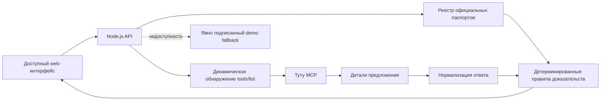

# Туту.Можно

> **Билет купить можно. А добраться — точно?**

«Туту.Можно» собирает паспорт доступности конкретной поездки: сопоставляет предложение транспорта с официальными сведениями об объектах, показывает слабое звено и не называет маршрут доступным, пока выбранные условия не подтверждены.

Проект создан для ИИ-хакатона Туту × MCP 2026. Транспортные предложения запрашиваются через публичный [Туту MCP](https://mcp.tutu.ru/mcp), а продуктовый слой отдельно показывает подтверждённые факты, правила оценки и неизвестные данные.

## Ссылки для проверки

- Публичный репозиторий: https://github.com/aidafonda/tutu-mozhno
- Работающий прототип: будет добавлен после деплоя
- Пользовательская документация: `/docs` на адресе прототипа
- Реестр доказательств: `/registry` на адресе прототипа
- Health-check: `/api/health`
- Список обнаруженных инструментов MCP: `/api/mcp/tools`
- Пилотный реестр доступности: `/api/accessibility/registry`

## Проблема

Обычный поиск отвечает на вопрос «есть ли билет?». Для путешественника с особыми требованиями к мобильности этого недостаточно: подходящий поезд не поможет, если пересадка, вход на вокзал или отсутствие сопровождения делают поездку невозможной.

Рынок уже предлагает отдельные accessibility-фильтры и карты доступных мест. Продуктовая гипотеза «Туту.Можно» — объединить транспортный поиск и проверку всей цепочки поездки по принципу слабого звена.

## Для кого

Основной сегмент MVP — самостоятельные путешественники с ограничениями мобильности. Расширяемые сегменты: пожилые пассажиры, люди после временной травмы, родители с детской коляской, пассажиры с тяжёлым багажом и сопровождающие.

Продукт спрашивает только необходимые условия поездки и не собирает диагнозы.

## Основной сценарий

1. Пользователь указывает маршрут, дату и транспорт.
2. Выбирает необходимые условия.
3. Backend обнаруживает доступные инструменты Туту MCP и вызывает подходящий поисковый инструмент.
4. Для железнодорожных предложений загружаются детали класса обслуживания через `get_offer_details`.
5. Станции сопоставляются с версионируемым реестром официальных паспортов доступности.
6. Детерминированный продуктовый слой сопоставляет каждое требование с доказательством или маркирует его как неизвестное.
7. Пользователь видит статус, слабое звено, источники и действия до оплаты.
8. Оформление продолжается на Туту.

## Принципы безопасности

- Нет данных — значит «Нужно уточнить», а не «Подходит».
- Демо-данные всегда визуально и технически подписаны как демонстрационные.
- Числовой процент доступности не используется: он создаёт ложную точность.
- Вывод алгоритма не выдаётся за подтверждение перевозчика.
- Сервис не хранит медицинские данные и не выполняет бронирование.

## Архитектура



Проект намеренно не требует LLM-ключа: критическое решение о доступности не должно зависеть от недетерминированного текста модели. MCP-клиент поддерживает JSON и Server-Sent Events, session ID, тайм-аут и динамическое обнаружение инструментов.

## Структура репозитория

```text
.
├── public/               # web-интерфейс и /docs
├── src/                  # MCP-клиент, продуктовые правила и реестр доступности
├── tests/                # unit-тесты
├── docs/                 # product, pitch и deploy
├── server.mjs
├── Dockerfile
├── docker-compose.yml
└── Caddyfile
```

## Локальный запуск

Требуется Node.js 20 или новее. Внешние npm-зависимости не используются.

```bash
cp .env.example .env
npm start
```

Открыть:

- приложение — `http://localhost:3000`;
- документация — `http://localhost:3000/docs`;
- диагностика — `http://localhost:3000/api/health`.

## Тесты

```bash
npm test
```

Проверяются серверная валидация дат, построение состава пассажиров из динамической MCP-схемы, разбор SSE, защита от ложных предложений из метаданных, сопоставление вокзалов, авиационный багаж, детали автобуса и вагона, доказательная оценка условий и честная маркировка demo fallback.

## Docker и production

```bash
cp .env.example .env
# Указать APP_DOMAIN и направить домен на VPS
docker compose up -d --build
docker compose ps
```

Caddy автоматически получает TLS-сертификат. Контейнер приложения имеет health-check и автоматический перезапуск. Подробности — в [docs/DEPLOY.md](docs/DEPLOY.md).

## API

### `POST /api/search`

```json
{
  "from": "Москва",
  "to": "Санкт-Петербург",
  "date": "2026-08-20",
  "mode": "train",
  "stepFree": true,
  "assistance": true,
  "accessibleToilet": false,
  "maxWalk": 300
}
```

Поле `mode` в ответе: `live` — предложения получены через Туту MCP; `demo` — показаны демонстрационные карточки с явным предупреждением. Чтобы запретить fallback, установите `FALLBACK_MODE=off`.

### `GET /api/accessibility/registry`

Возвращает версию, методологию, покрытие и факты пилотного реестра со ссылкой и датой проверки каждого официального источника.

### Диагностика

- `/api/live` — процесс принимает запросы;
- `/api/ready` — приложение готово обслуживать поиск, отдельно показывает состояние MCP;
- `/api/health` — расширенная диагностика сервиса и последней проверки MCP.

## Известные ограничения

- Нестандартный обязательный параметр MCP может потребовать отдельного адаптера.
- Пилотный реестр покрывает Ленинградский вокзал Москвы и Московский вокзал Санкт-Петербурга; отсутствие объекта означает «нет данных».
- Нет оперативных сведений о поломках лифтов, полной длине внутренних переходов и доступности последней мили.
- `BIO_TOILET` в MCP не считается доказательством доступного санузла.
- Поддерживается первый проход нормализации распространённых форматов предложений.
- Приложение не гарантирует доступность инфраструктуры и предлагает подтверждение у перевозчика.

## Product discovery

User Stories, JTBD, метрики и rollout собраны в [docs/PRODUCT.md](docs/PRODUCT.md). Структура выступления — в [docs/PITCH.md](docs/PITCH.md).
Результаты прогонов — в [docs/TEST_REPORT.md](docs/TEST_REPORT.md), требования для внедрения в инфраструктуру Туту — в [docs/TUTU_INTEGRATION.md](docs/TUTU_INTEGRATION.md).

## Лицензия

MIT. Название и товарные знаки Туту принадлежат правообладателю; проект является конкурсным прототипом и не представляет официальный продукт компании.
