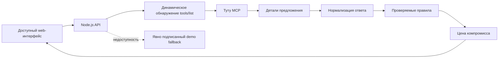

# Туту.Можно

> **Билет купить можно. А добраться — точно?**

«Туту.Можно» подбирает маршруты по условиям, которые можно подтвердить данными конкретного предложения, а затем показывает цену компромисса: сколько пользователь сэкономит или выиграет во времени и каким условием ради этого пожертвует. Непроверяемые критерии в форму не попадают.

Проект создан для ИИ-хакатона Туту × MCP 2026. Транспортные предложения запрашиваются через публичный [Туту MCP](https://mcp.tutu.ru/mcp), а продуктовый слой отдельно показывает подтверждённые факты, правила оценки и неизвестные данные.

## Ссылки для проверки

- Публичный репозиторий: https://github.com/aidafonda/tutu-mozhno
- Работающий прототип: будет добавлен после деплоя
- Пользовательская документация: `/docs` на адресе прототипа
- Реестр доказательств: `/registry` на адресе прототипа
- Health-check: `/api/health`
- Список обнаруженных инструментов MCP: `/api/mcp/tools`
- Пилотный реестр доступности: `/api/accessibility/registry`
- Дорожная карта инклюзивной экосистемы: `/inclusion`

## Проблема

Обычный поиск показывает цену и время, но заставляет открывать каждое предложение, чтобы проверить важные условия. Пользователь не должен выбирать критерий, на который сервис всё равно ответит «уточните у перевозчика».

Продуктовая гипотеза «Туту.Можно» — превратить данные тарифов и оснащения в проверяемые фильтры и объяснить результат без технического шума.

## Для кого

MVP полезен путешественникам с конкретными бытовыми требованиями: прямой маршрут, ребёнок в составе пассажиров, багаж и оснащение транспорта. Инклюзивные критерии вернутся только после появления достаточного покрытия надёжными данными.

Продукт спрашивает только необходимые условия поездки и не собирает диагнозы.

## Основной сценарий

1. Пользователь указывает маршрут, дату и транспорт.
2. Видит только условия, подтверждаемые для выбранного транспорта, и выбирает нужные.
3. Backend обнаруживает доступные инструменты Туту MCP и вызывает подходящий поисковый инструмент.
4. Для поездов и автобусов загружаются детали предложения через `get_offer_details`; для авиа читаются условия тарифов.
5. Детерминированный продуктовый слой сопоставляет каждое выбранное условие с конкретным полем ответа.
6. Полное совпадение получает зелёный статус, подтверждённое отсутствие условия — красный.
7. Decision-слой сравнивает лучшее совпадение с самым быстрым и дешёвым вариантами в рублях, минутах и невыполненных условиях.
8. Оформление продолжается на Туту.

## Принципы безопасности

- Критерий появляется в форме, только если его можно подтвердить или опровергнуть для выбранного вида транспорта.
- Нет данных — значит «Нет данных», а не «Подходит».
- Демо-данные всегда визуально и технически подписаны как демонстрационные.
- Числовой процент доступности не используется: он создаёт ложную точность.
- Вывод алгоритма не выдаётся за подтверждение перевозчика.
- Сервис не хранит медицинские данные и не выполняет бронирование.

## Архитектура



Проект намеренно не требует LLM-ключа: проверка структурированных условий не должна зависеть от недетерминированного текста модели. MCP-клиент поддерживает JSON и Server-Sent Events, session ID, тайм-аут и динамическое обнаружение инструментов.

## Структура репозитория

```text
.
├── public/               # web-интерфейс и /docs
├── src/                  # MCP-клиент, продуктовые правила и реестр доступности
├── tests/                # unit-тесты
├── docs/                 # product, pitch и deploy
├── server.mjs
├── Dockerfile
├── docker-compose.yml
└── Caddyfile
```

## Локальный запуск

Требуется Node.js 20 или новее. Внешние npm-зависимости не используются.

```bash
cp .env.example .env
npm start
```

Открыть:

- приложение — `http://localhost:3000`;
- документация — `http://localhost:3000/docs`;
- диагностика — `http://localhost:3000/api/health`.

## Тесты

```bash
npm test
```

Проверяются серверная валидация дат, построение состава пассажиров из динамической MCP-схемы, разбор SSE, защита от ложных предложений из метаданных, сопоставление вокзалов, авиационный багаж, детали автобуса и вагона, доказательная оценка условий и честная маркировка demo fallback.

## Docker и production

```bash
cp .env.example .env
# Указать APP_DOMAIN и направить домен на VPS
docker compose up -d --build
docker compose ps
```

Caddy автоматически получает TLS-сертификат. Контейнер приложения имеет health-check и автоматический перезапуск. Подробности — в [docs/DEPLOY.md](docs/DEPLOY.md).

## API

### `POST /api/search`

```json
{
  "from": "Москва",
  "to": "Санкт-Петербург",
  "date": "2026-08-20",
  "mode": "train",
  "directOnly": true,
  "onboardToilet": true,
  "airConditioning": true
}
```

Поле `mode` в ответе: `live` — предложения получены через Туту MCP; `demo` — показаны демонстрационные карточки с явным предупреждением. Чтобы запретить fallback, установите `FALLBACK_MODE=off`.

### `GET /api/accessibility/registry`

Возвращает версию, методологию, покрытие и факты пилотного реестра со ссылкой и датой проверки каждого официального источника.

### Диагностика

- `/api/live` — процесс принимает запросы;
- `/api/ready` — приложение готово обслуживать поиск, отдельно показывает состояние MCP;
- `/api/health` — расширенная диагностика сервиса и последней проверки MCP.

## Известные ограничения

- Нестандартный обязательный параметр MCP может потребовать отдельного адаптера.
- Инфраструктурная доступность, коляски, питомцы, сопровождение и длина пешего пути исключены из основной формы: MCP не даёт достаточных данных для строгой проверки.
- «Туалет в транспорте» означает только наличие обычного туалета в оснащении, а не доступный санузел.
- Для поездов MCP принимает только взрослых пассажиров, поэтому детский критерий показывается только для авиа и автобусов.
- Поддерживается первый проход нормализации распространённых форматов предложений.
- Приложение не гарантирует доступность инфраструктуры и предлагает подтверждение у перевозчика.

## Product discovery

User Stories, JTBD, метрики и rollout собраны в [docs/PRODUCT.md](docs/PRODUCT.md). Структура выступления — в [docs/PITCH.md](docs/PITCH.md).
Результаты прогонов — в [docs/TEST_REPORT.md](docs/TEST_REPORT.md), требования для внедрения в инфраструктуру Туту — в [docs/TUTU_INTEGRATION.md](docs/TUTU_INTEGRATION.md).
Отдельная модель данных и этапы инклюзивной экосистемы — в [docs/INCLUSION_ROADMAP.md](docs/INCLUSION_ROADMAP.md) и на странице `/inclusion`.

## Лицензия

MIT. Название и товарные знаки Туту принадлежат правообладателю; проект является конкурсным прототипом и не представляет официальный продукт компании.
